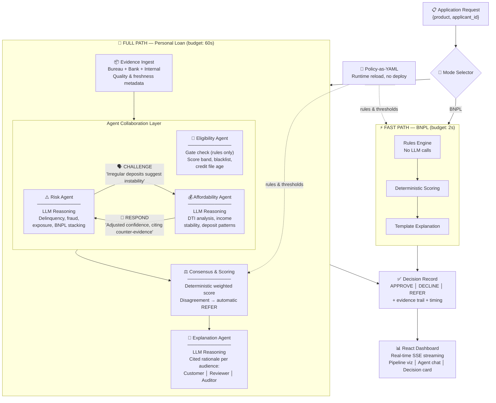
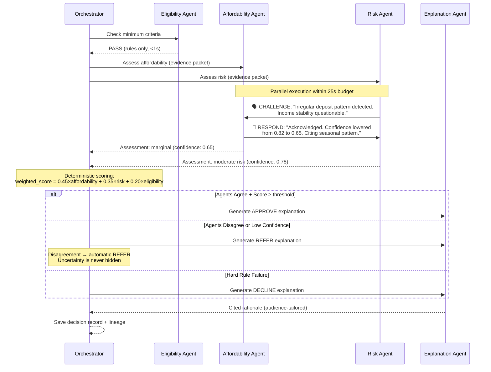

# Credit Genie

> **Agentic AI Build Week 2026 — GoTyme Use Case 7: Credit Decisioning**

An agentic credit decision engine where specialized AI agents collaborate like a credit committee — debating, challenging, and citing evidence — to deliver fast, consistent, explainable lending decisions.

---

## The Problem Space

### Why Credit Decisioning is Broken

Digital banks process thousands of loan applications daily. The current state is fundamentally flawed:

**1. Fragmented Evidence, No Unified Truth**

A single applicant's creditworthiness is scattered across 5+ disconnected sources: credit bureau scores, bank transaction history, existing loan obligations, employment records, and behavioral signals. Today, rule engines consume flat features — they cannot *reason* about contradictions (e.g., high income but irregular deposits suggesting instability).

**2. Policy Changes Are Deployment Events**

When a bank's risk appetite shifts (recession, new regulation, competitive pressure), updating decision rules requires developer involvement, code changes, testing cycles, and deployment windows. A policy change that should take hours takes weeks. During that gap, decisions are made against stale rules.

**3. Decisions Are Black Boxes**

Regulators require explanations. Customers demand transparency. Internal reviewers need audit trails. Yet traditional scoring models produce a number — not a narrative. "Score: 642, Declined" tells no one *why*, and no one can challenge it meaningfully.

**4. One-Size-Fits-All Execution**

A $50 Buy-Now-Pay-Later purchase and a $50,000 personal loan cannot use the same decision depth. BNPL needs sub-2-second response. Personal loans can afford 60 seconds of deep reasoning. Traditional systems either over-engineer the simple case or under-serve the complex one.

### The GoTyme Challenge

GoTyme Bank needs a system that handles **both** products through a unified policy framework, adapts to policy changes without deployment, explains every decision with cited evidence, and surfaces disagreement rather than hiding uncertainty.

---

## How Agentic AI Solves This

### Why Agents — Not Rules, Not a Single LLM Call

| Approach | Limitation |
|----------|-----------|
| Rule engines | Cannot reason about nuance, contradictions, or novel patterns |
| Single LLM call | No separation of concerns, no adversarial checking, hallucination risk on financial data |
| **Multi-agent collaboration** | **Specialized reasoning + adversarial verification + cited evidence + deterministic scoring** |

### The Agentic Architecture

Credit Genie uses a **hybrid deterministic-agentic architecture**: Python orchestrates the pipeline deterministically (for auditability), while specialized LLM agents handle reasoning at leaf nodes (where human-like judgment adds value).



#### How Agent Collaboration Works (A2A Protocol)



### Agent Roles & Collaboration

| Agent | Purpose | Method | Why Agentic? |
|-------|---------|--------|--------------|
| **Orchestrator** | Pipeline coordination, time budgets, decision records | Deterministic Python | Ensures reproducibility for audit |
| **Eligibility** | Gate check — score band, blacklist, credit file age | Rules only | Binary pass/fail, no judgment needed |
| **Affordability** | Can applicant service this debt? | LLM (OpenAI via LangChain) | Reasons about income stability, deposit irregularities, employment patterns |
| **Risk** | What could go wrong? | LLM (OpenAI via LangChain) | Adversarially challenges Affordability, detects fraud signals, assesses exposure |
| **Explanation** | Generate cited rationale | LLM (OpenAI via LangChain) | Produces human-readable narratives tailored to audience |

### Agent-to-Agent (A2A) Collaboration Protocol

This is not prompt chaining. Agents actively collaborate:

1. **Risk challenges Affordability** — "Your DTI looks adequate, but I see irregular deposit patterns suggesting income instability. Reconsider."
2. **Affordability responds** — Adjusts confidence score, cites additional evidence, or rebuts with counter-evidence.
3. **Disagreement triggers REFER** — When agents cannot reach consensus, the decision escalates automatically. No silent overrides.

This mimics how a real credit committee works: specialists debate, challenge assumptions, and escalate genuine uncertainty.

### Why This Architecture Works for Banking

| Banking Requirement | How Credit Genie Addresses It |
|--------------------|-----------------------------|
| **Auditability** | Deterministic scoring layer — same inputs always produce same score |
| **Explainability** | Every decision includes cited evidence trail per audience |
| **Speed** | Dual-mode: 2s BNPL (rules), 60s personal loan (agents) |
| **Adaptability** | Policy-as-YAML, reload at runtime, no deployment needed |
| **Safety** | Agent disagreement surfaces as REFER, not hidden consensus |
| **Transparency** | Real-time SSE streaming shows agents reasoning live |

---

## Key Innovation: Policy-as-YAML with Runtime Reload

```yaml
# policy/personal_loan.yaml — change thresholds without deployment
segments:
  standard:
    score_band_minimum: 580
    dti_decline_ceiling: 0.55
    weights:
      affordability: 0.45
      risk: 0.35
      eligibility: 0.20
    thresholds:
      approve: 72
      refer: 55
```

Update YAML → next decision uses new rules. No deploy. No restart. Demonstrated live with Aisha Mohammed persona: DECLINE under old policy, APPROVE after threshold change.

---

## Dual Execution Modes

| | Personal Loan (Full Path) | BNPL (Fast Path) |
|---|---|---|
| **Budget** | 60 seconds | 2 seconds |
| **Method** | Multi-agent LLM reasoning | Deterministic rules only |
| **Agents** | Eligibility + Affordability + Risk + Explanation | None (zero LLM calls) |
| **Explanation** | Rich, cited, audience-tailored | Template-based |
| **When** | High-value decisions needing nuance | High-volume, low-risk purchases |

Same policy schema. Same evidence format. Different execution depth. One architecture.

---

## Impact & Real-World Usefulness

- **Decision speed**: 60s for complex loans (vs. days with manual review), 2s for BNPL
- **Policy agility**: Hours to update rules (vs. weeks of development cycles)
- **Transparency**: Every decision is explainable and challengeable
- **Safety**: Disagreement surfaces as REFER — uncertainty is never hidden
- **Scalability**: BNPL path handles high volume without LLM costs; full path reserved for decisions that need depth

---

## Demo Scenarios

| Persona | Product | Outcome | What It Demonstrates |
|---------|---------|---------|---------------------|
| Sarah Chen | PL + BNPL | APPROVE | Happy path — agents agree, clean evidence |
| Raj Patel | PL | REFER | **Agent disagreement** — Risk challenges Affordability on contradictory income signals |
| Maria Santos | BNPL | DECLINE | Fast path — over-exposure caught by rules in <2s |
| James Wilson | PL | DECLINE | Severe delinquency — hard rule failure |
| Aisha Mohammed | PL | DECLINE→APPROVE | **Runtime policy change** — update YAML, decision flips without restart |

---

## Tech Stack

| Layer | Technology |
|-------|-----------|
| Agent Framework | Deep Agents + LangGraph + LangChain-OpenAI |
| Backend | Python 3.12, FastAPI, Uvicorn |
| LLM | OpenAI (via LangChain-OpenAI) |
| Frontend | React 19, TypeScript, Vite, Tailwind CSS 4 |
| Real-time | SSE (Server-Sent Events) |
| Policy Engine | YAML with runtime reload |
| Validation | Pydantic |
| Deployment | AWS |

---

## Quick Start

```bash
# Backend
cd backend
uv sync
cp .env.example .env  # Add OPENAI_API_KEY
uv run uvicorn main:app --reload

# Frontend
cd frontend
npm install
npm run dev
```

---

## Documentation

- [Architecture](docs/architecture.md)
- [Agent Design & A2A Protocol](docs/agent-design.md)
- [Decision Modes & Controls](docs/decision-modes-and-controls.md)
- [Hackathon Submission](docs/hackathon-submission.md)
- [Scope](docs/scope.md)
