# Credit Genie — Agent Design, Tools, MCP & A2A Protocol

## 1. Agent Roles & Behavior

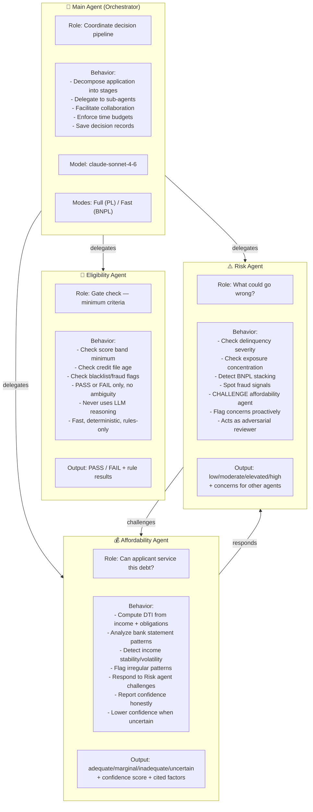

---

## 2. Agent Communication Protocol (A2A)

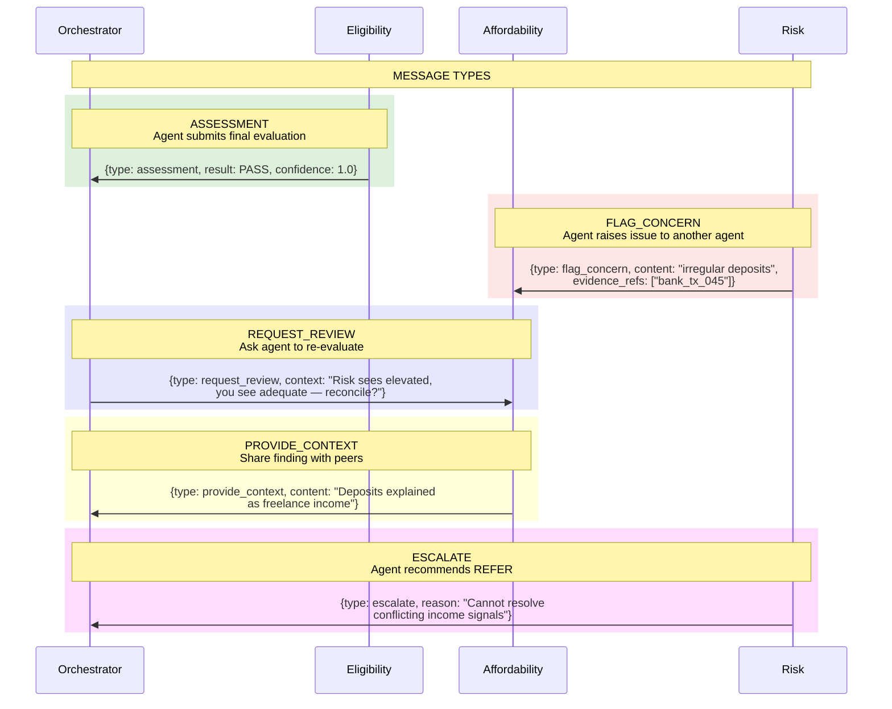

---

## 3. A2A Collaboration Patterns

```mermaid
flowchart TD
    subgraph Pattern1["Pattern: CHALLENGE"]
        P1_1[Risk detects anomaly] --> P1_2[Risk sends FLAG_CONCERN to Affordability]
        P1_2 --> P1_3[Affordability re-evaluates with context]
        P1_3 --> P1_4{Resolved?}
        P1_4 -->|Yes| P1_5[Updated assessment<br/>possibly lower confidence]
        P1_4 -->|No| P1_6[ESCALATE to Orchestrator<br/>→ REFER]
    end

    subgraph Pattern2["Pattern: CONSENSUS CHECK"]
        P2_1[All agents submit assessments] --> P2_2{Score gap < 0.4?}
        P2_2 -->|Yes| P2_3[Proceed to scoring]
        P2_2 -->|No| P2_4[Orchestrator sends REQUEST_REVIEW]
        P2_4 --> P2_5[Agents refine positions]
        P2_5 --> P2_6{Still disagree?}
        P2_6 -->|Yes| P2_7[REFER with both viewpoints]
        P2_6 -->|No| P2_3
    end

    subgraph Pattern3["Pattern: MISSING EVIDENCE"]
        P3_1[Evidence packet has gaps] --> P3_2[Orchestrator notifies affected agents]
        P3_2 --> P3_3[Agents assess with lower confidence]
        P3_3 --> P3_4{Confidence < threshold?}
        P3_4 -->|Yes| P3_5[Force REFER<br/>"Insufficient data for auto-decision"]
        P3_4 -->|No| P3_6[Proceed with flagged assessment]
    end
```

---

## 4. Tools Architecture

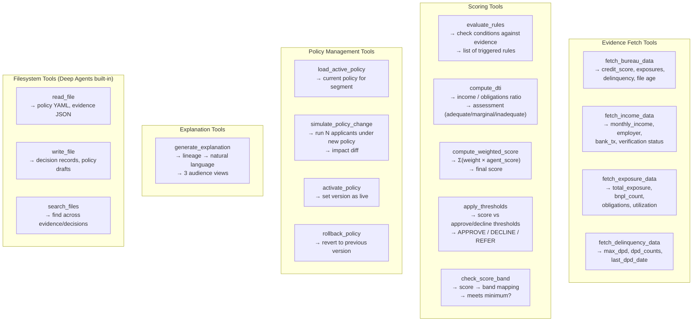

---

## 5. Tool Assignment per Agent

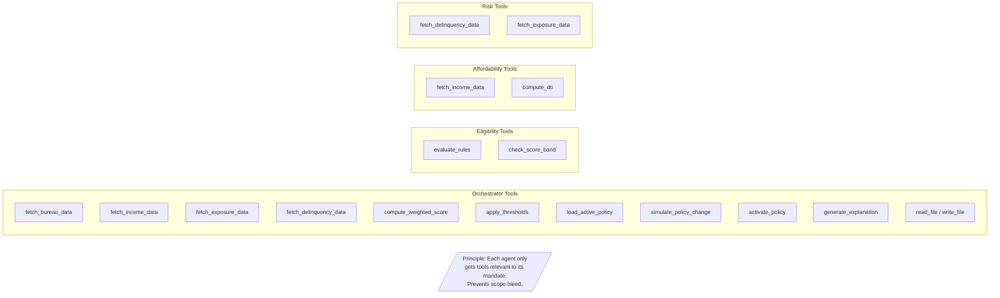

---

## 6. MCP (Model Context Protocol) Integration

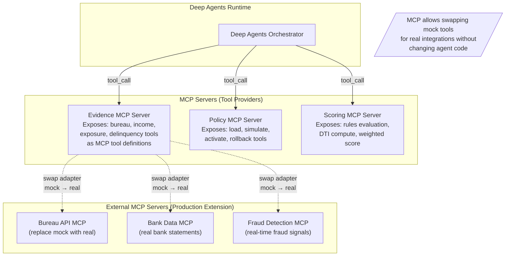

---

## 7. MCP Tool Definition Schema

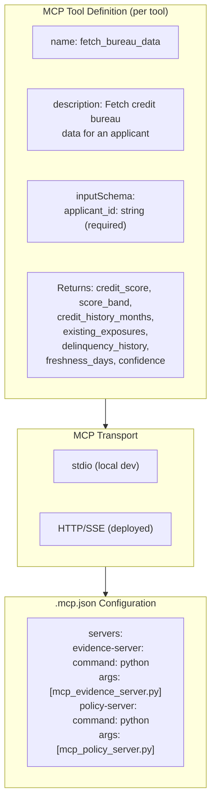

---

## 8. A2A (Agent-to-Agent) Protocol for Multi-Agent

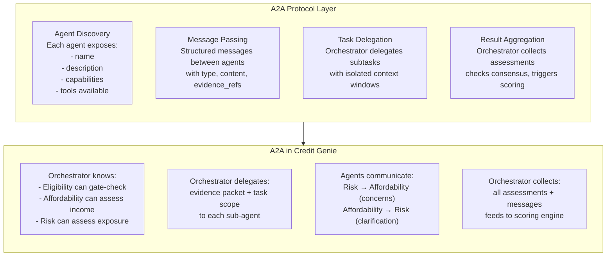

---

## 9. A2A Message Flow (Detailed)

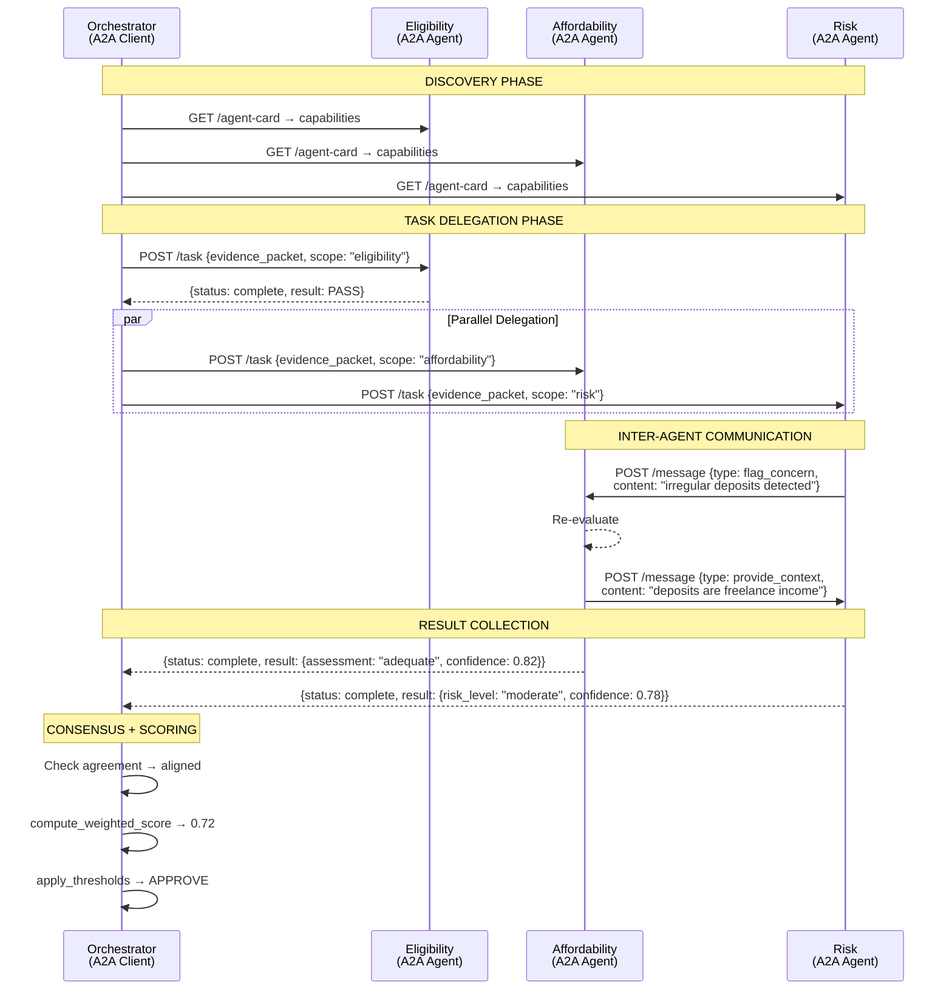

---

## 10. Deep Agents Deploy — Production Architecture

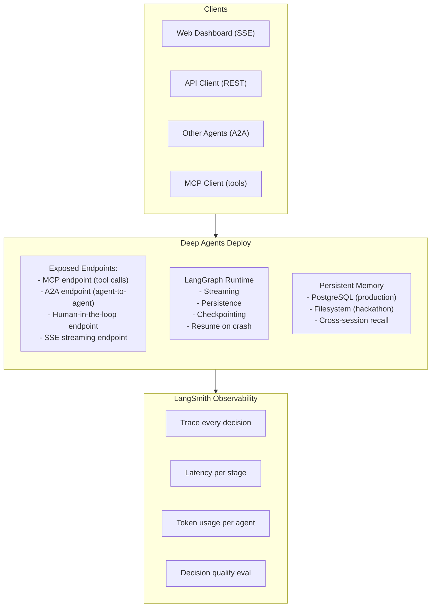

---

## 11. Skills Structure

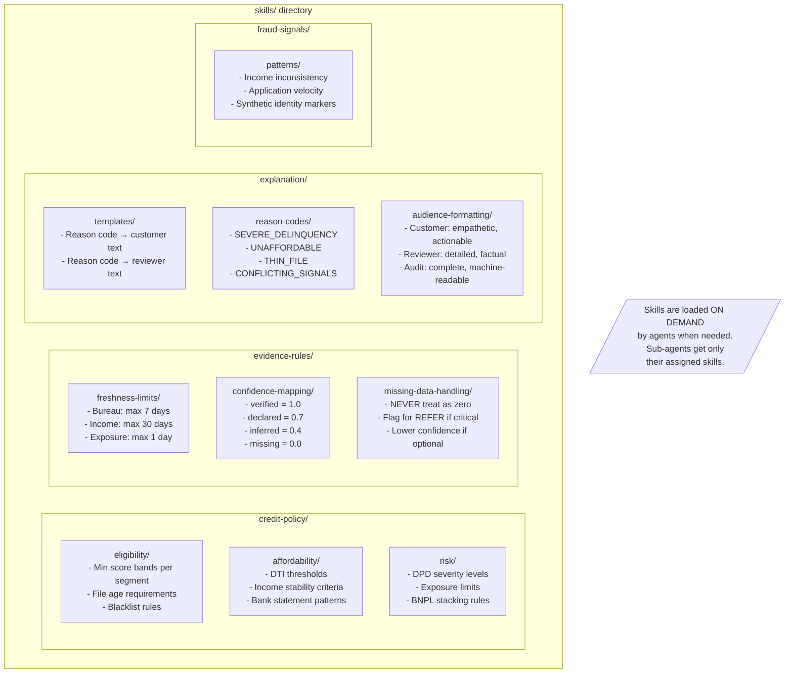

---

## 12. Complete System — All Components Connected

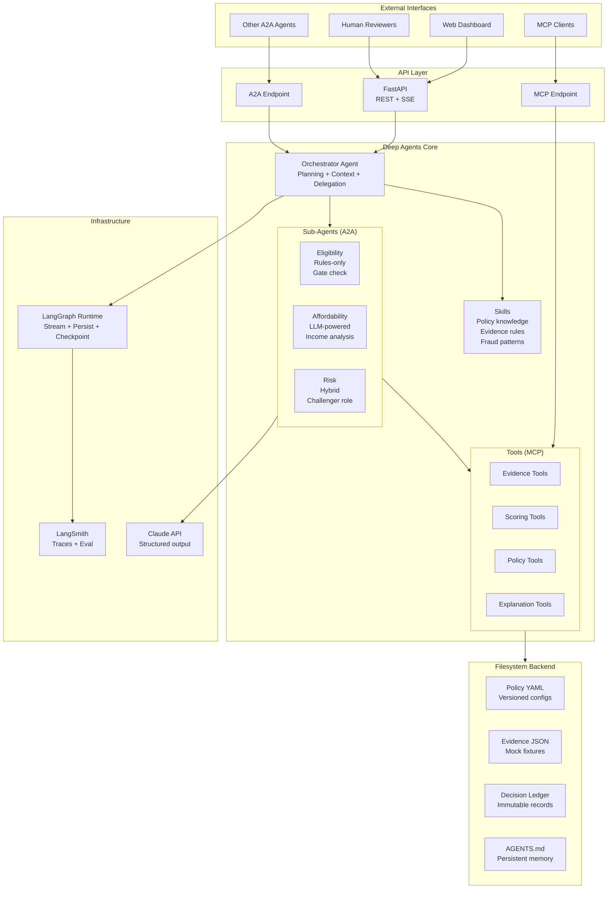
