# Credit Genie — Architecture (Deep Agents / LangChain)

## 1. High-Level Architecture

```mermaid
graph TB
    subgraph Frontend["Frontend (React + Vite)"]
        UI[Decision Dashboard]
        PipelineViz[Pipeline Visualization]
        AgentChat[Agent Conversation Stream]
        PolicyEditor[Policy Editor]
    end

    subgraph DeepAgents["Deep Agents Harness"]
        Orchestrator[Main Agent - Orchestrator]
        
        subgraph SubAgents["Sub-Agents"]
            Eligibility[Eligibility Agent]
            Affordability[Affordability Agent]
            Risk[Risk Agent]
        end

        subgraph Skills["Skills"]
            PolicySkill[/skills/credit-policy/]
            EvidenceSkill[/skills/evidence-rules/]
            ExplainSkill[/skills/explanation/]
        end

        Planning[Planning / TODO Tool]
        ContextMgmt[Context Management]
    end

    subgraph Backend["Filesystem Backend"]
        PolicyStore[policy/*.yaml]
        EvidenceStore[evidence/{applicant}/]
        DecisionLedger[decisions/*.json]
        Memory[AGENTS.md - Persistent Memory]
    end

    subgraph Tools["Custom Tools"]
        EvidenceTools[Evidence Fetch Tools]
        ScoringTools[Scoring Tools]
        PolicyTools[Policy Management Tools]
        ExplainTools[Explanation Generator]
    end

    UI -->|SSE Stream| Orchestrator
    PolicyEditor -->|PUT /policy| PolicyTools
    Orchestrator --> Eligibility
    Orchestrator --> Affordability
    Orchestrator --> Risk
    Eligibility --> EvidenceTools
    Affordability --> EvidenceTools
    Risk --> EvidenceTools
    Orchestrator --> ScoringTools
    Orchestrator --> ExplainTools
    EvidenceTools --> EvidenceStore
    ScoringTools --> PolicyStore
    PolicyTools --> PolicyStore
    Orchestrator --> DecisionLedger
    Orchestrator --> Memory
    Skills -.->|loaded on demand| SubAgents
    Planning -.-> Orchestrator
    ContextMgmt -.-> Orchestrator
```

---

## 2. Deep Agents Component Mapping

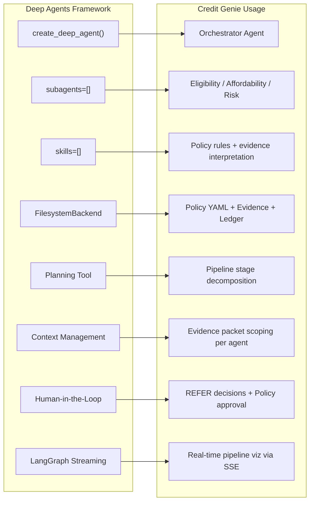

---

## 3. Decision Pipeline Flow

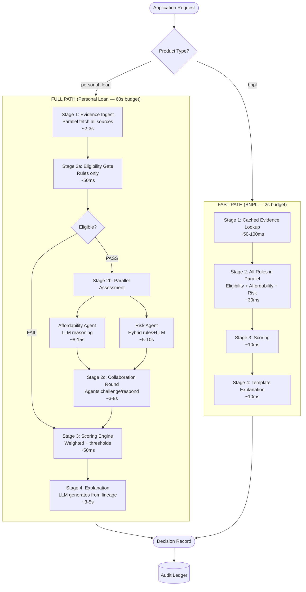

---

## 4. Agent Collaboration Protocol

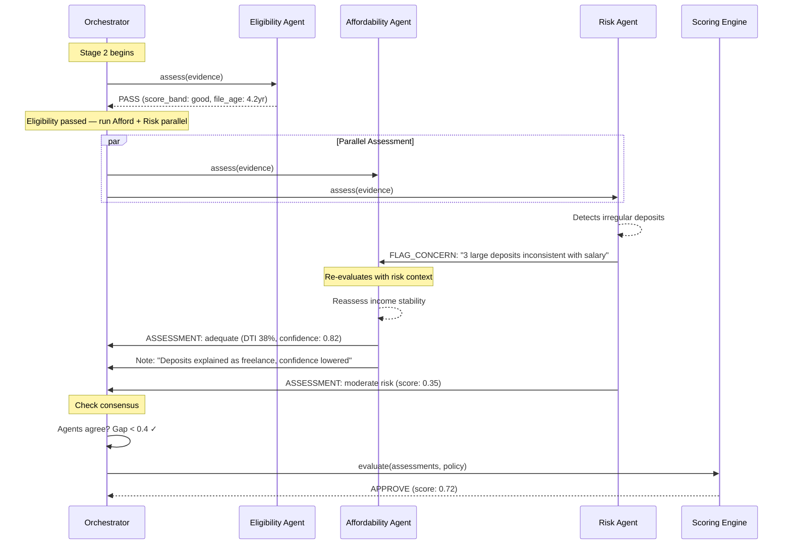

---

## 5. Agent Disagreement → REFER

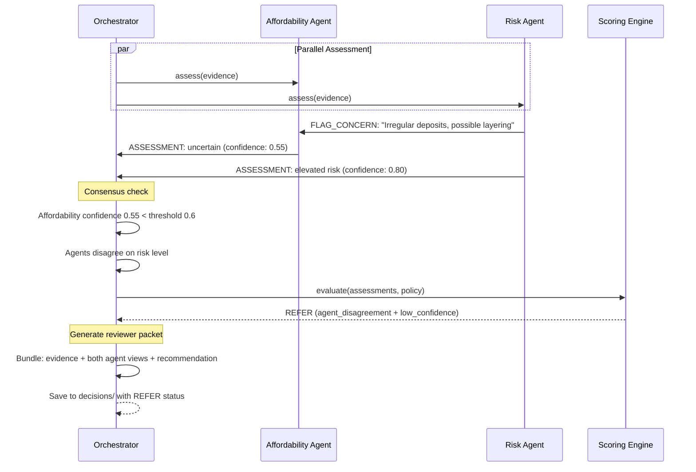

---

## 6. Policy Change Lifecycle

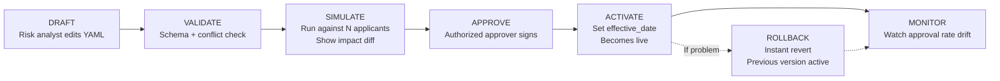

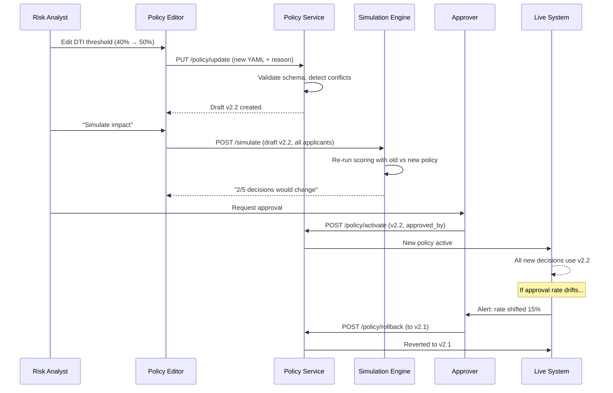

---

## 7. Evidence Ingest Flow

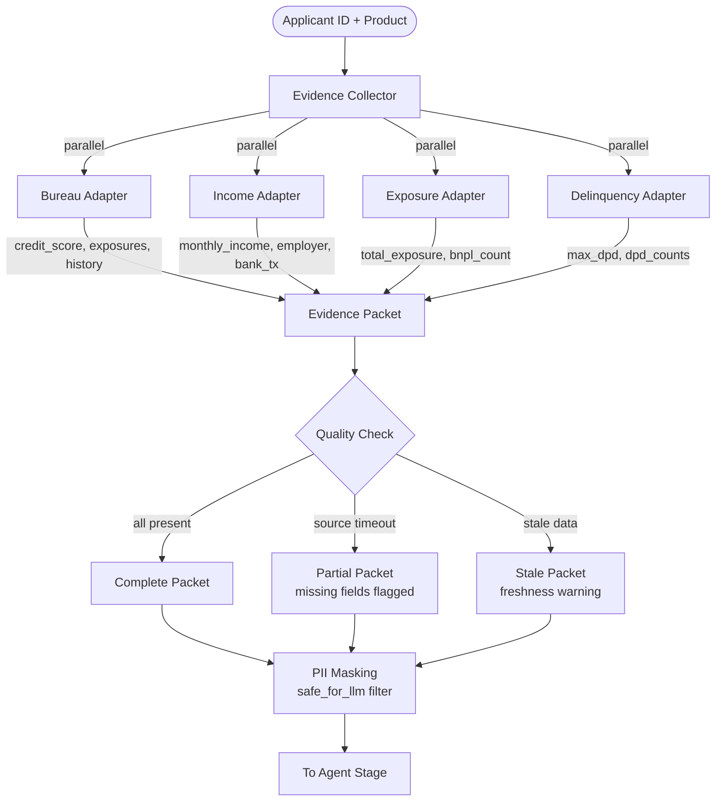

---

## 8. Scoring & Decision Logic

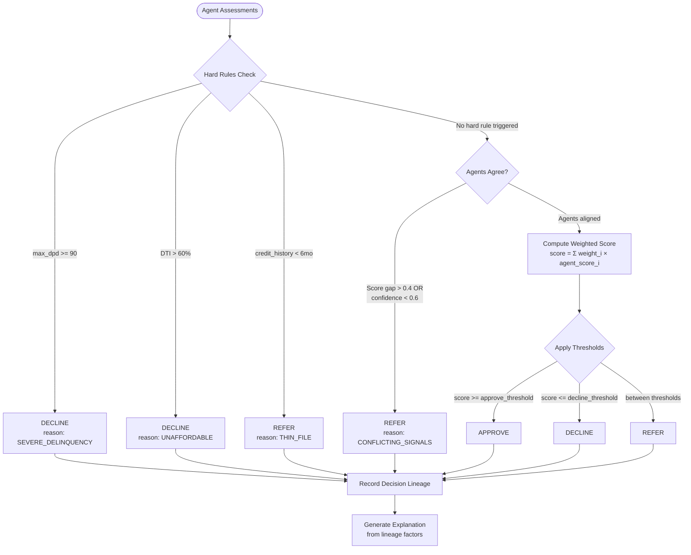

---

## 9. Explanation Generation

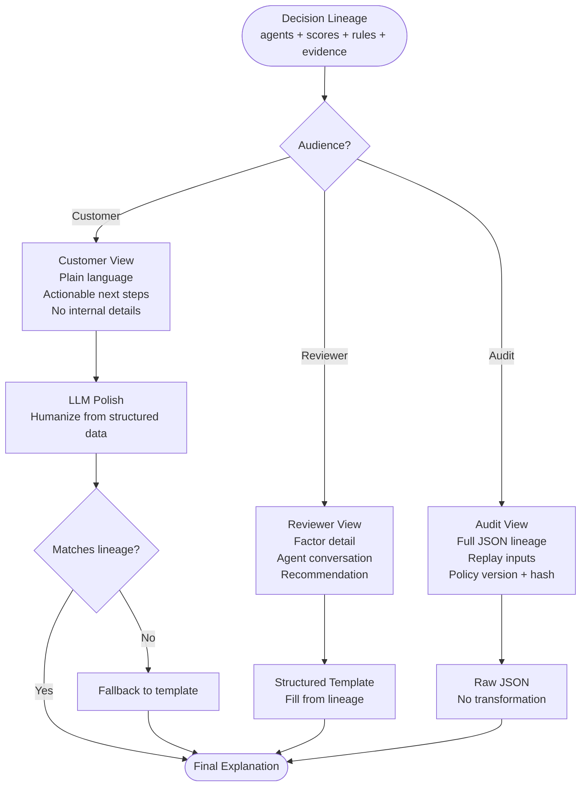

---

## 10. Real-Time Pipeline Visualization (SSE)

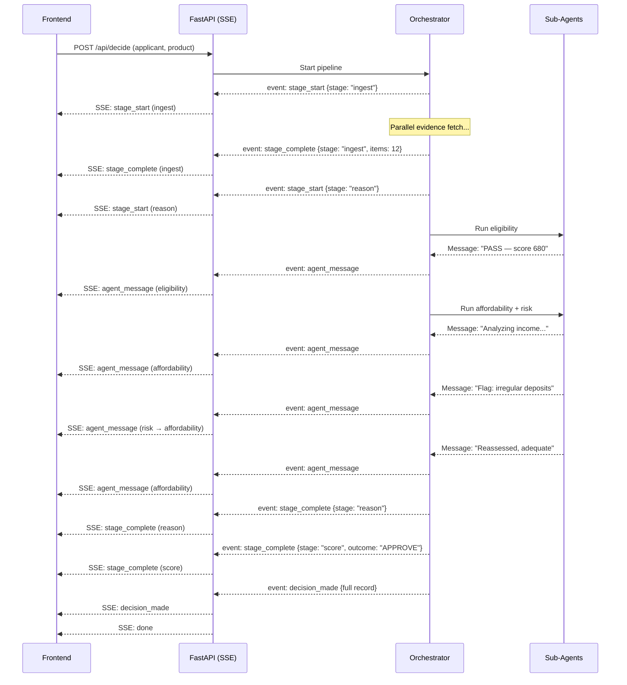

---

## 11. BNPL vs Personal Loan — Execution Mode Comparison

```mermaid
graph TB
    subgraph PersonalLoan["Personal Loan (Full Path)"]
        direction TB
        PL_Budget["⏱ Budget: 60 seconds"]
        PL_Evidence["Evidence: Live fetch, all sources"]
        PL_Agents["Agents: LLM-powered reasoning"]
        PL_Collab["Collaboration: Agents challenge each other"]
        PL_Explain["Explanation: LLM-generated narrative"]
        PL_Refer["REFER: Judgment calls allowed"]
    end

    subgraph BNPL["BNPL (Fast Path)"]
        direction TB
        BP_Budget["⏱ Budget: 2 seconds"]
        BP_Evidence["Evidence: Cached/pre-computed only"]
        BP_Agents["Agents: Rules-only, no LLM"]
        BP_Collab["Collaboration: None"]
        BP_Explain["Explanation: Template fill"]
        BP_Refer["REFER: Only hard triggers"]
    end

    subgraph Shared["Shared Across Both"]
        direction TB
        S_Policy["Same policy config"]
        S_Schema["Same evidence schema"]
        S_Ledger["Same audit ledger format"]
        S_HardRules["Same hard rules"]
    end

    PersonalLoan --- Shared
    BNPL --- Shared
```

---

## 12. Security & Governance Flow

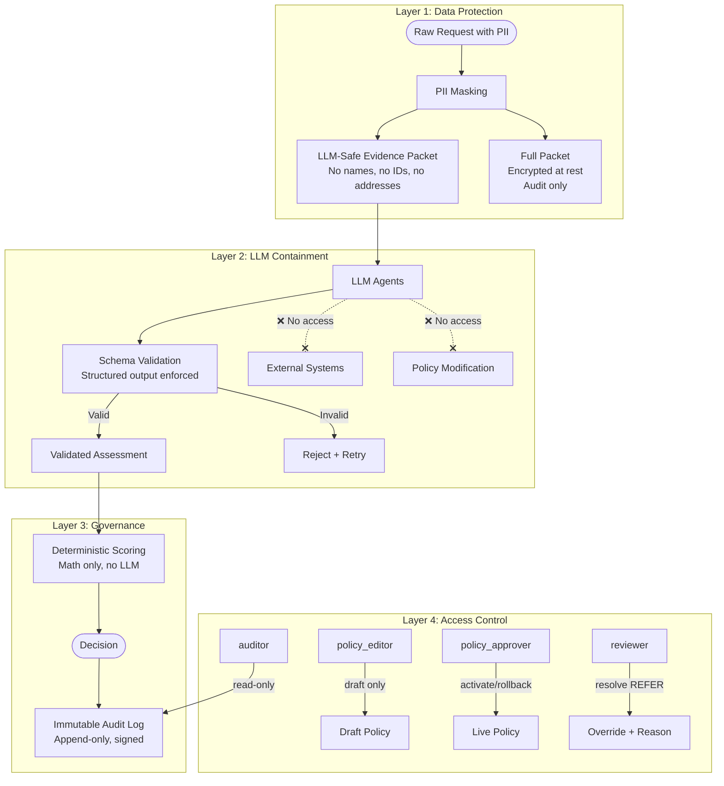

---

## 13. Timeout & Degradation Strategy

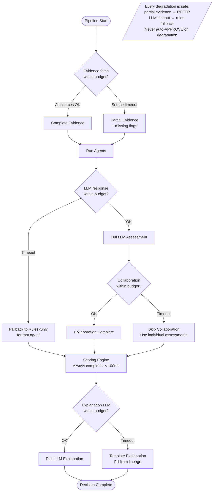

---

## 14. Filesystem Backend Structure

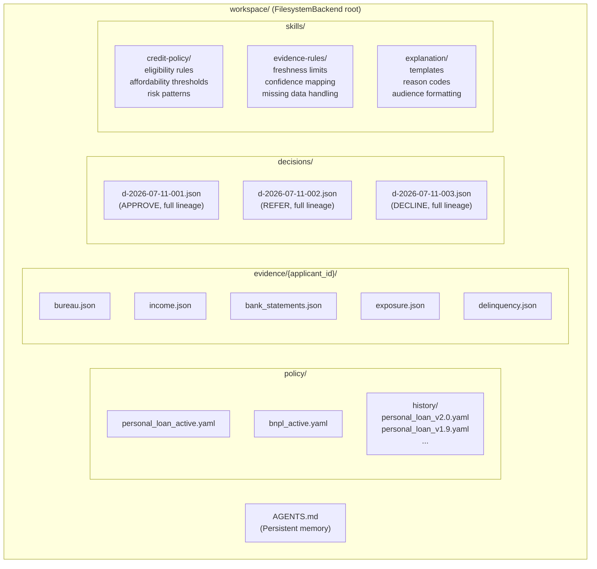

---

## 15. Demo Architecture (End-to-End)

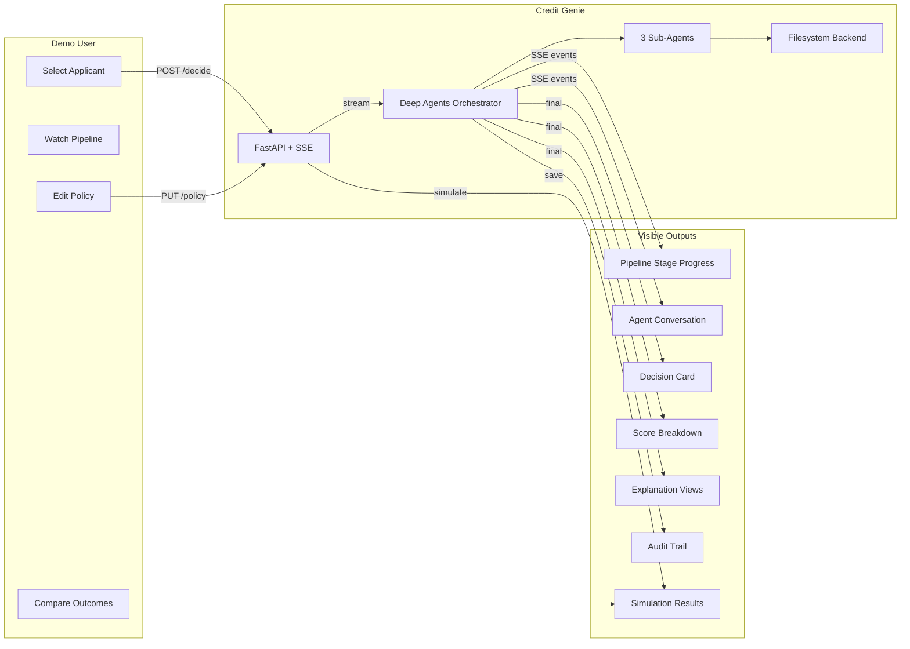

---

## 16. Tech Stack

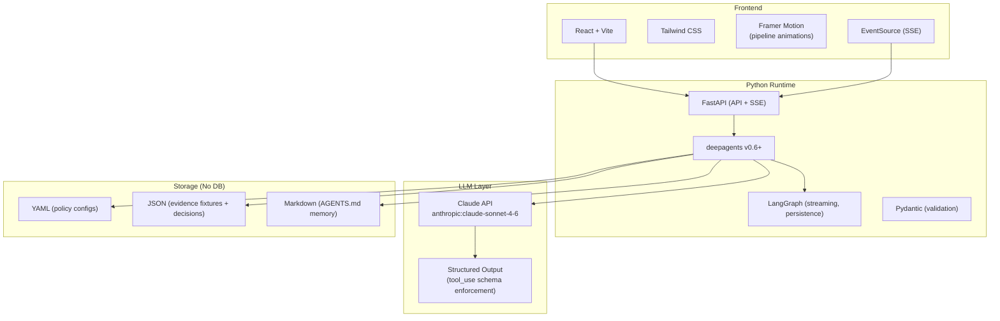
