# Credit Genie — Low-Level Architecture (Deep Agents)

## 1. Module Dependency Graph

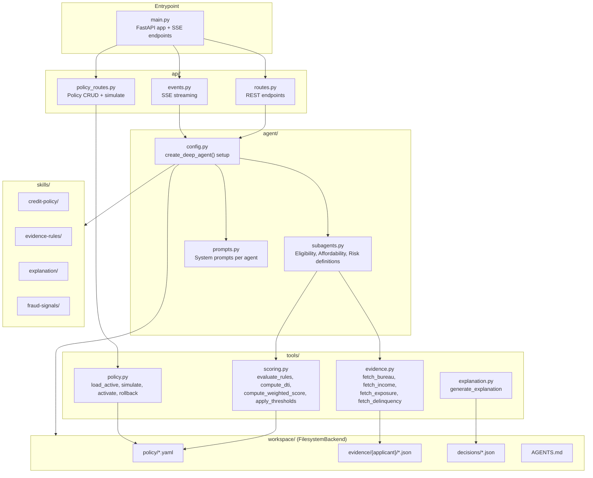

---

## 2. Deep Agents Runtime Internals

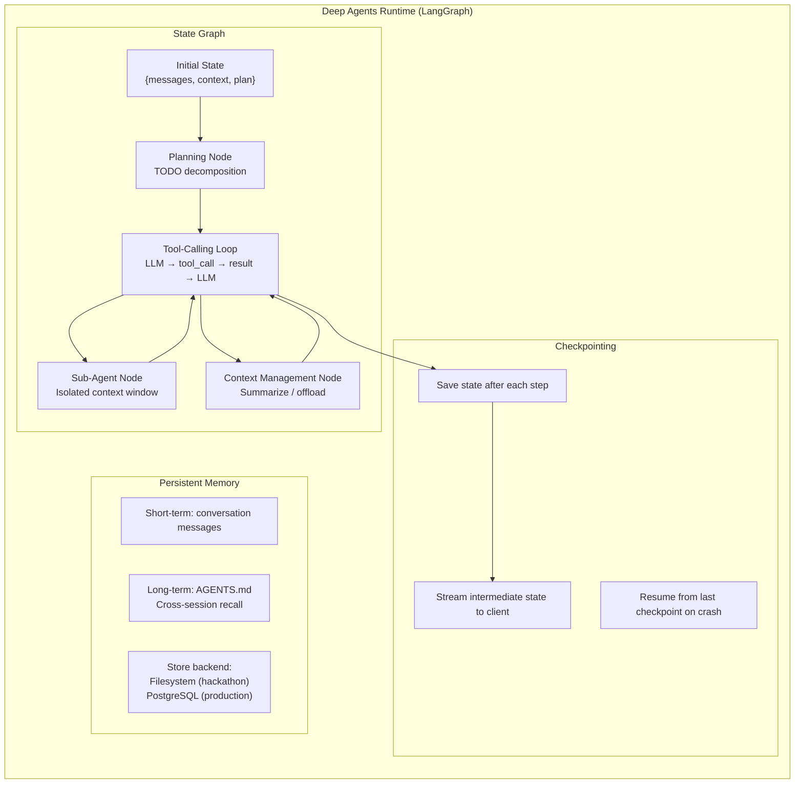

---

## 3. Request Lifecycle (Full Path — Personal Loan)

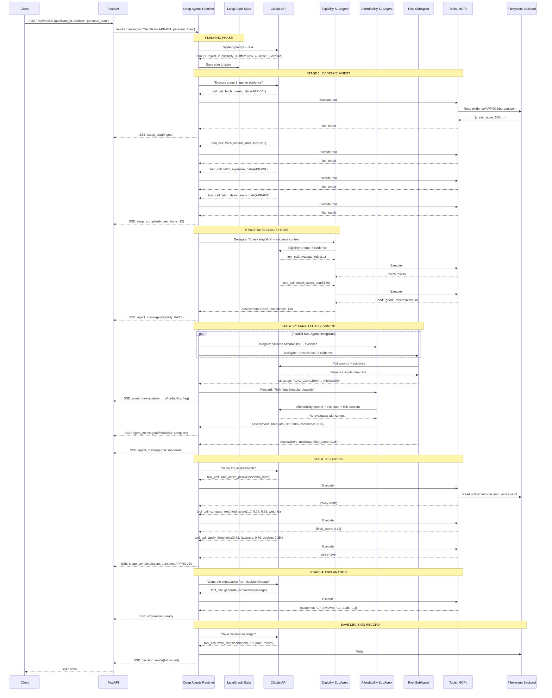

---

## 4. Request Lifecycle (Fast Path — BNPL)

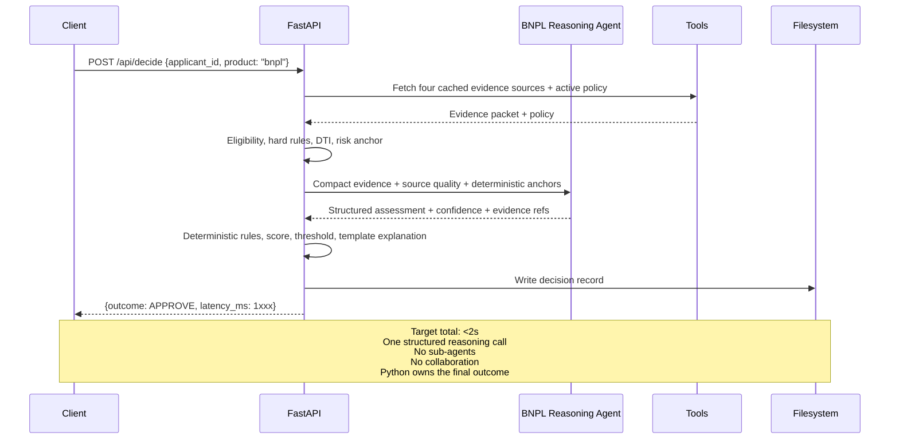

---

## 5. Sub-Agent Internal Flow

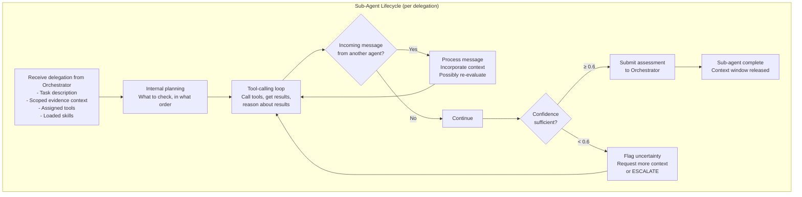

---

## 6. Context Window Management

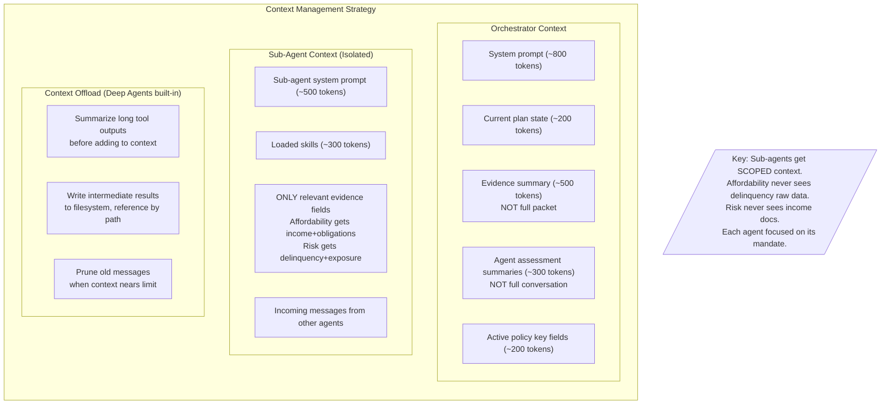

---

## 7. Evidence Packet Flow Through Pipeline

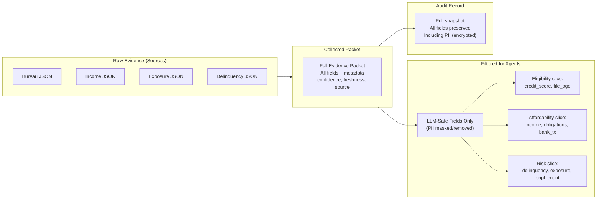

---

## 8. Scoring Engine Internal Logic

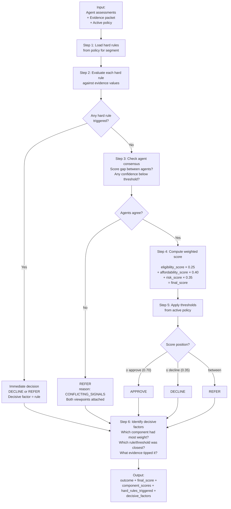

---

## 9. Policy Engine Internals

```mermaid
flowchart TD
    subgraph PolicyLifecycle["Policy Version Lifecycle"]
        direction LR
        YAML["YAML File<br/>on filesystem"] --> Parse["Parse + Validate<br/>Schema check<br/>Conflict detection"]
        Parse --> Version["Assign version<br/>+ hash + effective_date"]
        Version --> Draft["Status: DRAFT<br/>Not yet active"]
        Draft --> Simulate["Run simulation<br/>Against N applicants"]
        Simulate --> Compare["Show diff:<br/>old outcome vs new"]
        Compare --> Approve["Approver signs off<br/>Record: who, when, why"]
        Approve --> Active["Status: ACTIVE<br/>Used by all new decisions"]
        Active --> Monitor["Monitor approval rate"]
        Monitor -->|Drift detected| Alert["Alert approver"]
        Alert --> Rollback["ROLLBACK<br/>Revert to previous active"]
    end
```

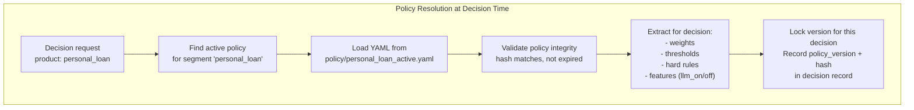

---

## 10. Explanation Generator Internals

```mermaid
flowchart TD
    subgraph ExplainPipeline["Explanation Generation Pipeline"]
        Lineage["Decision Lineage<br/>(structured data)"] --> Extract

        Extract["Extract decisive factors:<br/>- Which rules fired?<br/>- Which agent drove outcome?<br/>- What evidence was key?<br/>- What threshold was hit?"]

        Extract --> Router{Product mode?}

        Router -->|"Full path (PL)"| LLMExplain
        Router -->|"Fast path (BNPL)"| TemplateExplain

        subgraph LLMExplain["LLM Explanation (Personal Loan)"]
            LLM_Prompt["Prompt LLM with:<br/>- Structured lineage<br/>- Decisive factors<br/>- Agent reasoning excerpts<br/>- Audience instructions"]
            LLM_Generate["LLM generates<br/>natural language per audience"]
            LLM_Validate["Validate:<br/>Does explanation match lineage?<br/>Any facts not in evidence?"]
            LLM_Prompt --> LLM_Generate --> LLM_Validate
            LLM_Validate -->|Pass| LLM_Output["Approved explanation"]
            LLM_Validate -->|Fail| Fallback["Fallback to template"]
        end

        subgraph TemplateExplain["Template Explanation (BNPL)"]
            T_Lookup["Look up reason_code<br/>in policy config"]
            T_Fill["Fill template with<br/>actual values from evidence"]
            T_Format["Format per audience"]
            T_Lookup --> T_Fill --> T_Format
        end

        LLM_Output --> ThreeViews
        Fallback --> TemplateExplain
        T_Format --> ThreeViews

        ThreeViews["Three Views:<br/>1. Customer (empathetic, plain language)<br/>2. Reviewer (detailed, factual)<br/>3. Audit (full JSON, machine-readable)"]
    end
```

---

## 11. SSE Event Pipeline Internals

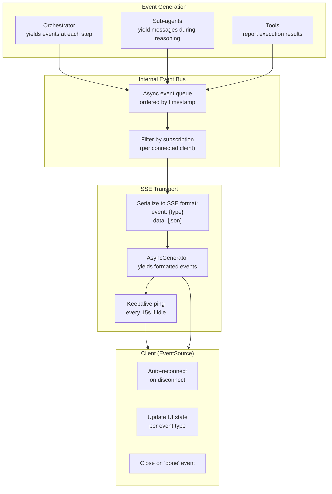

---

## 12. SSE Event Type Taxonomy

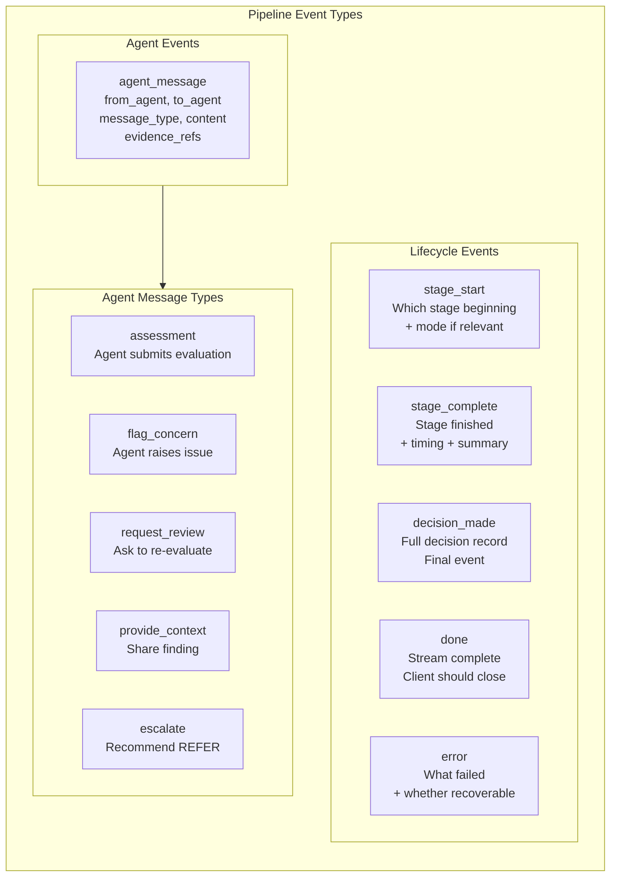

---

## 13. Timeout Budget Allocation

```mermaid
gantt
    title Personal Loan — Time Budget (60s total)
    dateFormat X
    axisFormat %s

    section Evidence Ingest
    Bureau fetch          :0, 2
    Income fetch          :0, 2
    Exposure fetch        :0, 1
    Delinquency fetch     :0, 1
    Timeout buffer        :2, 5

    section Agent Reasoning
    Eligibility (rules)   :5, 5
    Affordability (LLM)   :5, 20
    Risk (hybrid)         :5, 15
    Collaboration round   :20, 28

    section Scoring
    Policy load + compute :28, 28

    section Explanation
    LLM explanation       :29, 34
    Template fallback     :crit, 34, 35

    section Buffer
    Safety margin         :35, 60
```

```mermaid
gantt
    title BNPL — Time Budget (2s total)
    dateFormat X
    axisFormat %s

    section Evidence
    Cached lookup         :0, 100

    section Rules
    Eligibility rules     :100, 110
    Affordability rules   :100, 110
    Risk rules            :100, 110

    section Score
    Compute + threshold   :110, 120

    section Explain
    Template fill         :120, 130

    section Buffer
    Safety margin         :130, 2000
```

---

## 14. Error Handling & Recovery

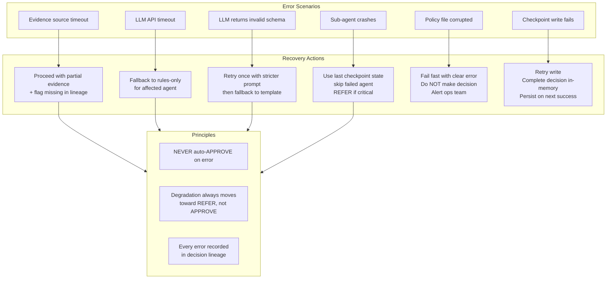

---

## 15. Data Flow — End to End (Complete)

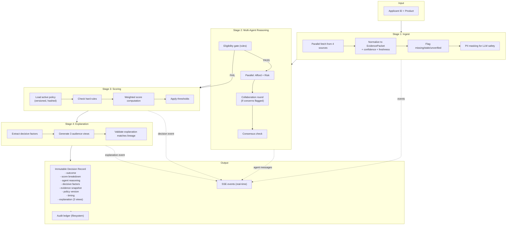

---

## 16. Deployment Topology

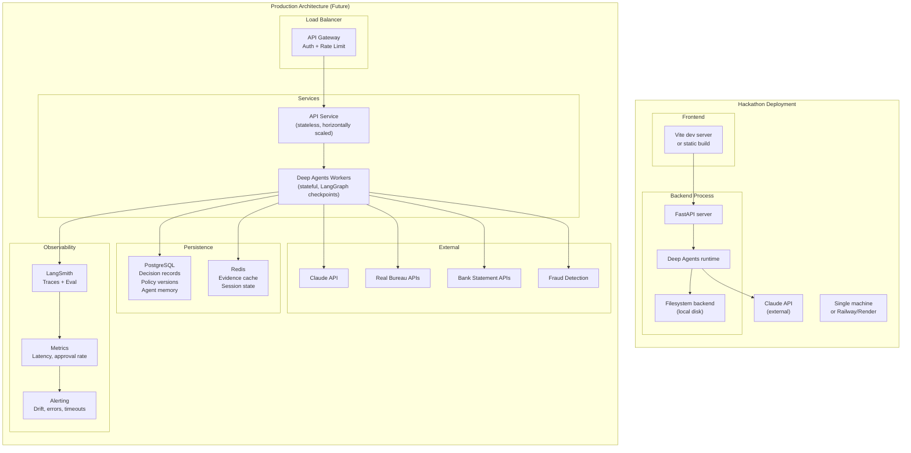
